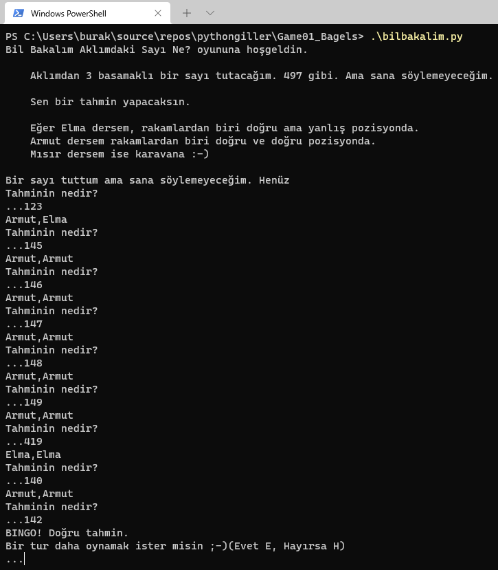
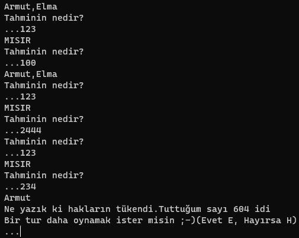
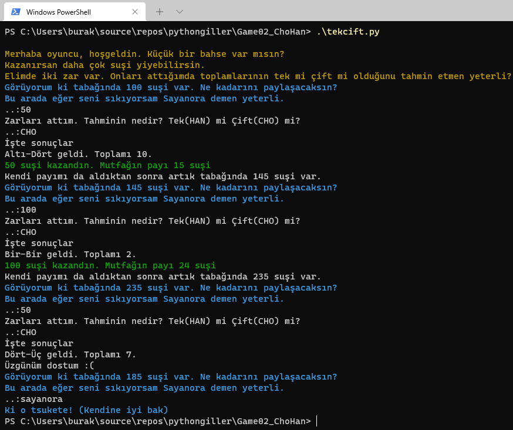

# PythonGiller

Python bilgilerimi eğlenceli bir şekilde hatırlamak ve daha da geliştirmek için [__The Big Book of Small Python Projects__](https://nostarch.com/big-book-small-python-projects) isimli bir kitap almıştım. Ne zamandır çalışacağım çalışacağım derken en sonunda kapağını açmayı başardım. Repo'daki amacım kitaptaki örnek programları her zaman olduğu gibi copy-paste yapmadan, biraz değiştirerek ama daha da önemlisi anlamaya çalışıp gerekli yorum satırlarını da ekleyerek çalışmak. İç motivasyonla yeni bir oyun alanı oluşturduğum için mutluyum. Örnekleri Windows 10 yüklü bir sistemde Visual Studio Code editörünü kullanarak yapmaktayım. Sistemde python yüklü tabii ki :)

## Sayı Tahmin Oyunu _(Bagels)_

Oyun 3 basamaklı bir sayıyı tahmin etmemizi istiyor. Belli sayıda deneme hakkımız var _(Örneğin 10)_. Matematiksel olarak tümdengelim yaklaşımı baz alınıyor. Şöyle ki,

- Tahmin ettiğimiz sayının herhangi bir rakamı/rakamları doğru ama yanlış basamaktaysa _Elma_
- Tahmin ettiğimiz sayının herhangi bir rakamı/rakamları doğru ve doğru basamaktaysa _Armut_
- Tahmin ettiğimiz sayı tamamen farklıysa yoksa _Mısır yani karavana_
- Deneme hakkımızda 10 olsun.

Oyunun çalışma zamanı çıktısı kendi sistemimde aşağıdakine benzer oldu.





### Öğrenilenler

- _main_ fonksiyonu program giriş noktası olarak kullanılabilir.
- Python kod bloklarını ayrıt etmek için girintili _(indentation)_ sözdizimi formatını kullanır.
- else if bloğu _elif_ şeklinde yazılır.
- _print_ fonksiyonunda placeholder kullanıldığında _format_ metot çağrısı ile değerleri verilebilir.
- Terminal girdilerini _input_ metodu ile alabiliriz.
- Döngü türlerinden birisi _while_ ifadesi dir ve koşul sağlandığı sürece çalışır.
- Bir diğer döngü şekli de for kullanımıdır.
- Döngü bloğundan çıkmak için _break_ kullanılabilir.
- Kodda kullanılan yardımcı modüller _import_ ile başlangıçta belirtilir.
- Bir metin katarının karakterlerine _[]_ indis operatörü ile erişebiliriz.
- Metin katarı içeriğini karakter bazında karıştırmak için _random_ modülünün _shuffle_ metodu kullanılabilir.
- Değişkenler isimleri ve değer atamaları ile tanımlanabilir. Tür belirtmeye gerek yoktur.

## Çift mi? Tek mi? _(Cho-Han)_

Oyun feodal Japonya'da geçen bir zar oyunu. Cho çift, Han ise tek anlamında. Oyuna katılan oyuncular bir bardak içinde sallanıp masaya atılan iki zarın rakamlar toplamının tek mi çift mi olduğunu tahmin etmeye çalışırlar. Zarları bambu ağaçtan yapılma bir bardakta krupiye sallar ve ortaya doğru gönderir. Göndermeden önce oyuncular tahminlerini yaparlar. Üstelik bu tahminlerini yaparken masaya bir miktar para da yatırırlar. Sonrası malum :-)

Şimdi biraz düşünelim...Bilgisayar, kurpiyer görevini üstlenecek. Oyuncu başlangıçta kasaya _(mutfak diyelim)_ belli miktar suşi yatırmak durumunda. Sahip olduğu suşilerin onun kendi tabağında olduğunu düşünelim. Oyuncu Tek veya çift diye bir tahminde bulunacak. Sonrasında bilgisayarın atacağı zarlar 1 ile 6 arasında rastgele iki sayı üretecek. Toplamına göre oyuncu suşi kazanacak ya da kaybedecek. Oyun, oyuncunun suşileri bitene ya da _sayanora_ yazana kadar devam edecek.

_Oyunda terminali biraz şenlendirmek adına termcolor isimli harici bir pakette kullandım_

```bash
pip install termcolor
````

Oyunun çalışma zamanı çıktısına ait bir görüntü.



### Öğrenilenler

- Uygulamadan çıkmak için _sys_ modülünün _exit_ fonksiyonu kullanılabilir.
- _{key:value,key:value,}_ notasyonu ile Dictionary koleksiyonları tanımlanabilir.
- _Dictionary_ deki bir çiftin değerine ulaşmak için _[key]_ index notasyonundan yararlanılır.
- Bir değerin sayısal olup olmadığını kontrol etmek için _isdecimal_ fonksiyonu kullanılabilir.
- rastgele tamsayı üretmek için random nesnesinin randint fonksiyonundan yararlanılır. Fonksiyona değer aralığı verilebilir.
- // operatörü ile bölme işlemi sonucu sola doğru yuvarlanır.
- Harici bir pip modülünü yüklemek için _pip install modüladı_ komutu kullanılabilir.
- Harici bir pakete başvurmadan \a komutunu kullanarak beep sesi çıkartabiliriz.