# PythonGiller

Python bilgilerimi eğlenceli bir şekilde hatırlamak ve daha da geliştirmek için [__The Big Book of Small Python Projects__](https://nostarch.com/big-book-small-python-projects) isimli bir kitap almıştım. Ne zamandır çalışacağım çalışacağım derken en sonunda kapağını açmayı başardım. Repo'daki amacım kitaptaki örnek programları her zaman olduğu gibi copy-paste yapmadan, biraz değiştirerek ama daha da önemlisi anlamaya çalışıp gerekli yorum satırlarını da ekleyerek çalışmak. İç motivasyonla yeni bir oyun alanı oluşturduğum için mutluyum. Örnekleri Windows 10 yüklü bir sistemde Visual Studio Code editörünü kullanarak yapmaktayım. Sistemde python yüklü tabii ki :)

## Sayı Tahmin Oyunu _(Bagels)_

__Game01_Bagles/bilbakalim.py__

Oyun 3 basamaklı bir sayıyı tahmin etmemizi istiyor. Belli sayıda deneme hakkımız var _(Örneğin 10)_. Matematiksel olarak tümdengelim yaklaşımı baz alınıyor. Şöyle ki,

- Tahmin ettiğimiz sayının herhangi bir rakamı/rakamları doğru ama yanlış basamaktaysa _Elma_
- Tahmin ettiğimiz sayının herhangi bir rakamı/rakamları doğru ve doğru basamaktaysa _Armut_
- Tahmin ettiğimiz sayı tamamen farklıysa yoksa _Mısır yani karavana_
- Deneme hakkımızda 10 olsun.

Oyunun çalışma zamanı çıktısı kendi sistemimde aşağıdakine benzer oldu.


### Öğrenilenler

- _main_ fonksiyonu program giriş noktası olarak kullanılabilir.
- Python kod bloklarını ayrıt etmek için girintili _(indentation)_ sözdizimi formatını kullanır.
- else if bloğu _elif_ şeklinde yazılır.
- _print_ fonksiyonunda placeholder kullanıldığında _format_ metot çağrısı ile değerleri verilebilir.
- Terminal girdilerini _input_ metodu ile alabiliriz.
- Döngü türlerinden birisi _while_ ifadesi dir ve koşul sağlandığı sürece çalışır.
- Bir diğer döngü şekli de for kullanımıdır.
- Döngü bloğundan çıkmak için _break_ kullanılabilir.
- Kodda kullanılan yardımcı modüller _import_ ile başlangıçta belirtilir.
- Bir metin katarının karakterlerine _[]_ indis operatörü ile erişebiliriz.
- Metin katarı içeriğini karakter bazında karıştırmak için _random_ modülünün _shuffle_ metodu kullanılabilir.
- Değişkenler isimleri ve değer atamaları ile tanımlanabilir. Tür belirtmeye gerek yoktur.

## Çift mi? Tek mi? _(Cho-Han)_

__Game02_ChoHan/tekcift.py__

Oyun feodal Japonya'da geçen bir zar oyunu. Cho çift, Han ise tek anlamında. Oyuna katılan oyuncular bir bardak içinde sallanıp masaya atılan iki zarın rakamlar toplamının tek mi çift mi olduğunu tahmin etmeye çalışırlar. Zarları bambu ağaçtan yapılma bir bardakta krupiye sallar ve ortaya doğru gönderir. Göndermeden önce oyuncular tahminlerini yaparlar. Üstelik bu tahminlerini yaparken masaya bir miktar para da yatırırlar. Sonrası malum.

Şimdi biraz düşünelim...Bilgisayar, kurpiyer görevini üstlenecek. Oyuncu başlangıçta kasaya _(mutfak diyelim)_ belli miktar suşi yatırmak durumunda. Sahip olduğu suşilerin onun kendi tabağında olduğunu düşünelim. Oyuncu Tek veya çift diye bir tahminde bulunacak. Sonrasında bilgisayarın atacağı zarlar 1 ile 6 arasında rastgele iki sayı üretecek. Toplamına göre oyuncu suşi kazanacak ya da kaybedecek. Oyun, oyuncunun suşileri bitene ya da _sayanora_ yazana kadar devam edecek.

_Oyunda terminali biraz şenlendirmek adına termcolor isimli harici bir pakette kullandım_

```bash
pip install termcolor
```

Oyunun çalışma zamanı çıktısına ait bir görüntü.


### Öğrenilenler

- Uygulamadan çıkmak için _sys_ modülünün _exit_ fonksiyonu kullanılabilir.
- key:value notasyonu ile Dictionary koleksiyonları tanımlanabilir.
- _Dictionary_ deki bir çiftin değerine ulaşmak için _[key]_ index notasyonundan yararlanılır.
- Bir değerin sayısal olup olmadığını kontrol etmek için _isdecimal_ fonksiyonu kullanılabilir.
- rastgele tamsayı üretmek için random nesnesinin randint fonksiyonundan yararlanılır. Fonksiyona değer aralığı verilebilir.
- // operatörü ile bölme işlemi sonucu sola doğru yuvarlanır.
- Harici bir pip modülünü yüklemek için _pip install modüladı_ komutu kullanılabilir.
- Harici bir pakete başvurmadan \a komutunu kullanarak beep sesi çıkartabiliriz.

## Havuç Hangi Kutuda _(Carrot in a Box)_

__Game03_CarrotInABox/havucnerede.py__

İki arkadaşın yan yana oynayabileceği bu enteresan oyunda terminal ekranında ASCII karakterleri ile çizilen iki kutu yer alıyor. Farklı renkteki bu kutuların birisinde havuç oluyor ve doğal olarak kutuların açık ve kapalı hallerinin de ASCII karakterleri ile çizilmesi gerekiyor :) Oyunda karşılıklı güven söz konusu olduğu kadar temelde blöf yapma ilkesi de yer alıyor. Nitekim oyunculardan birisi gözünü kapatırken bilgisayar diğer oyuncuya kutuları gösteriyor. Ardından gözleri kapalı olan oyuncu diğer oyuncunun kutusunda havuç olup olmadığını bilmeye çalışıyor. He hee :D Eğlenceli bir pratik olacağa benziyor.

Oyunun çalışma zamanından bazı görüntüler.

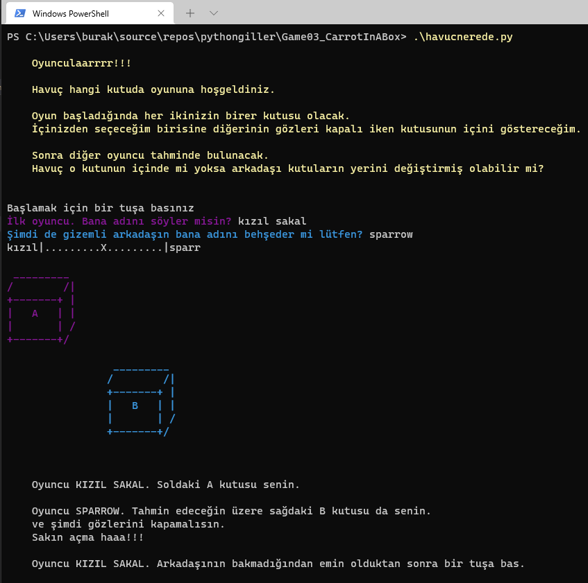

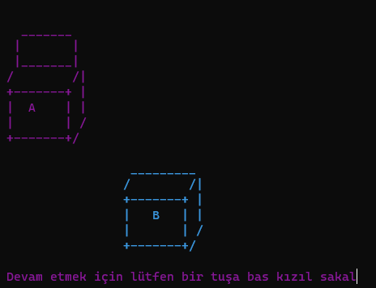

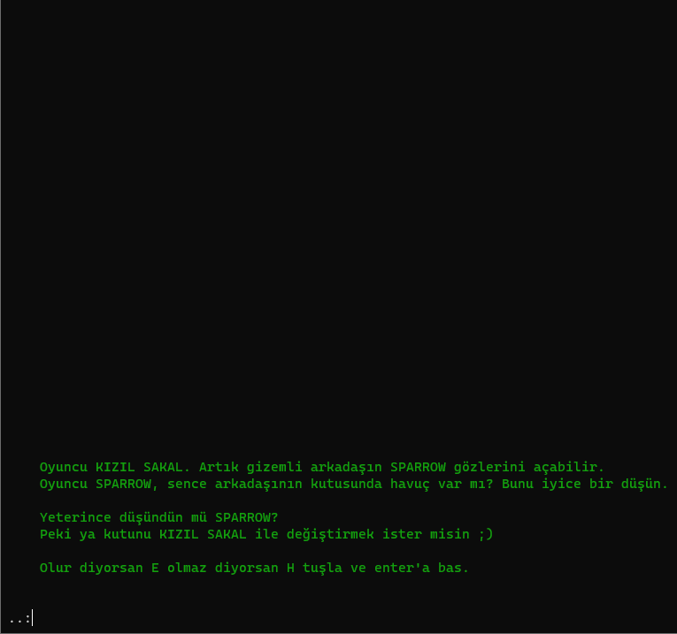


### Öğrenilenler

- Atamalarda birden eşitliğin sağ tarafındaki birden fazla değişken sol tarafta aynı sayıdaki değişkene atanabilir.
- ''' stilinde yazılan metinlerde {} için değişken adları yardımıyla aynı parametrenin birden fazla yerde kullanılması sağlanabilir.
- Main veya herhangi bir başka fonksiyonu bulunmayan python dosyaları betik olarak yukarıdan aşağıya işletilir.

## ASCII Kalp _(Bitmap Message)_

__Game04_AsciiHearth/kalpben.py__

Bu sefer bilgisayar oyuncudan 5 harfli bir kelime girmesini ve renk seçmesini istiyor. Sonra kendi sisteminde kayıtlı olan kalp metnini kullanarak ona bir çıktı üretiyor. Kitapta dünya haritası kullanılmıştı ben kalp seçtim ama başka alternatifler de kullanılabilir.

Oyunun çalışma zamanından bir görüntü. Kalp yerine örnek bir text dosyadan farklı resimler okutup daha çok seçenek sunabiliriz de ;)

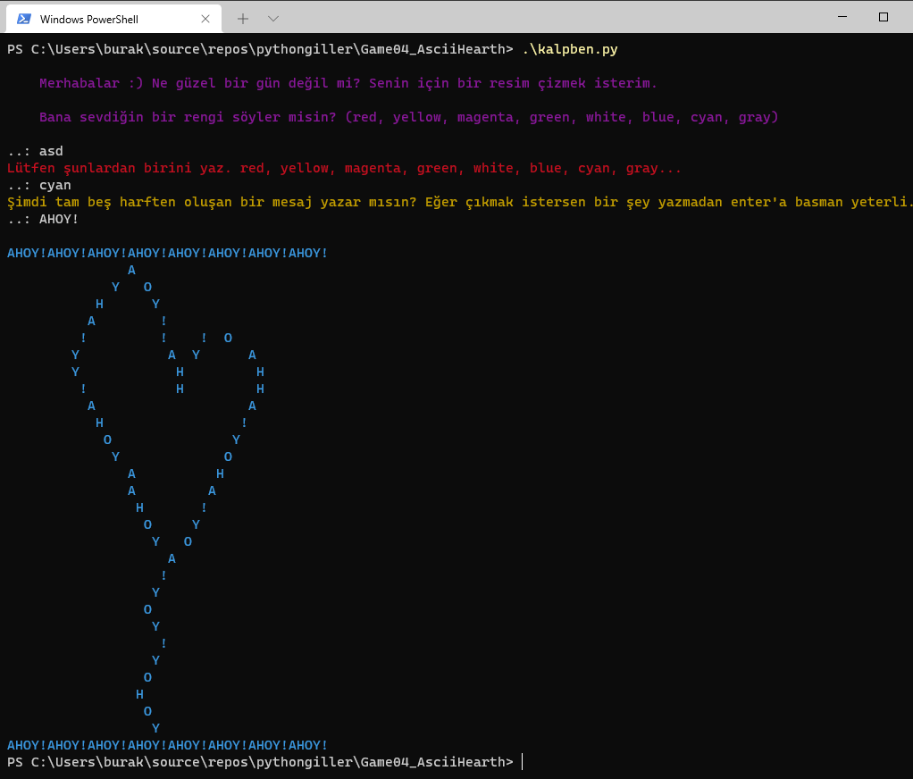

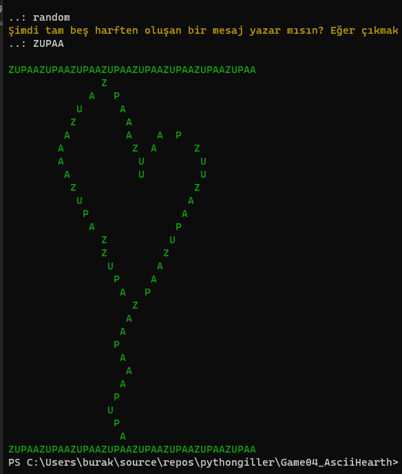

Aşağıdaki çıktı için [şu](https://emojipedia.org/people/) adrese gidip ilgili emoji'leri copy paste ile terminal ekranına yanyana koymak gerekiyor. Hatta bu emojileri kodda bir koleksiyonda saklayıp rastgele beşini bir araya getirip de oyuncu için rastgele sembollerden oluşan bir kalp resmi de çizdirebiliriz.

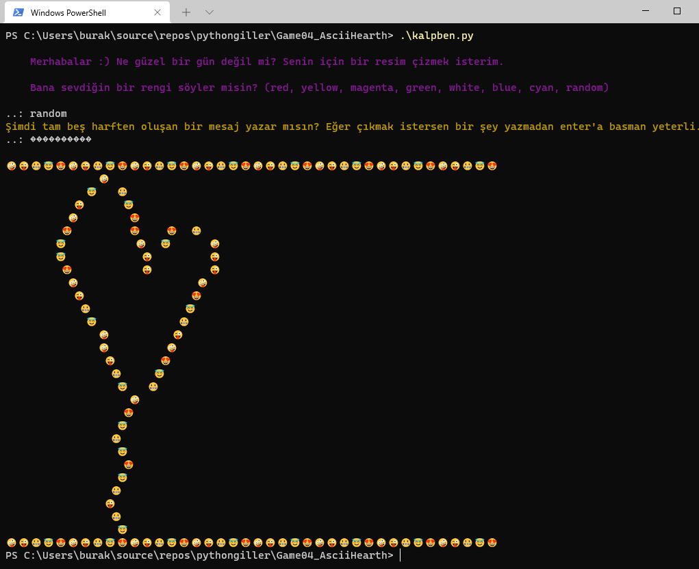

### Öğrenilenler

- Bir metin içeriğini splitlines ile satırlara bölüp okuyabiliriz.
- enumarates ile bir metin katarındaki içeriği indeks:karakter ikilisi olarak elde edebiliriz.
- _eleman not in dizi_ notasyonu ile bir değerin, bir dizi içinde olup olmadığını kontrol edebiliriz.

## Conway’in Hayat Oyunu _(Conway's Game of Life)_

__Game05_GameOfLife/hayatoyunu.py__

Kitaptan seçtiğim sıradaki bölüm ne yazık ki 2020 yılında Covid-19 yüzünden aramızdan ayrılan İngiliz matematikçi John Horton Conway'ın hayat oyunu. Bu oyun hücresel bir otomat oyunu olup sadece matematik değil biyoloji, fizik ve daha birçok disiplinde ele alınmaktadır. Hayatın temel özelliklerini model alan sonsuza dek yaşabilen bir oyundur. Oyunda siyah veya beyaz kutular söz konusudur. Siyah kutular canlıları, varlıkları veya örneğin bakterileri temsil edebilir. Diğer yandan beyaz kutular yokluk, boşluk ya da ölü olma halini ifade eder. Oyunun kuralları şöyledir.

- İki veya üç komşusu olan canlı hücreler simülasyonun bir sonraki adımında canlı kalırlar. Yani yaşamaya devam eder.
- Tam olarak üç komşusu olan ölü hücreler simülasyonun bir sonraki adımında canlanırlar. Doğum diyebiliriz.
- Yukarıdaki koşullar dışında kalan hücreler ya ölürler ya da ölü kalırlar. Söz gelimi üçten fazla komşusu olan canlı hücreler aşırı kalabalıktan dolayı, ikiden az komşusu olanlar da yalnızlıktan dolayı ölürler.

Matematiksel açıdan baktığımızda oyuncusu olmayan ve ilerleyen süreçteki simülasyonların akibetnin de oyun başlarkenki dağılıma göre şekillendiği ve fakat sonunun nereye varacağını tahmin edemediğimiz bir oyun bu :)

İşte yakaladığım birkaç görüntü.

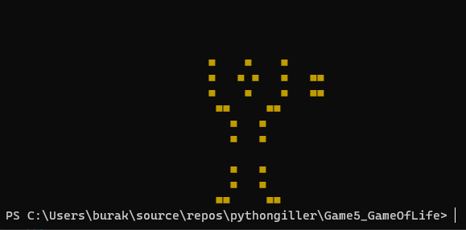

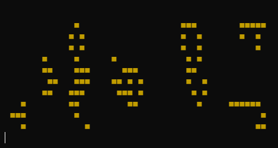

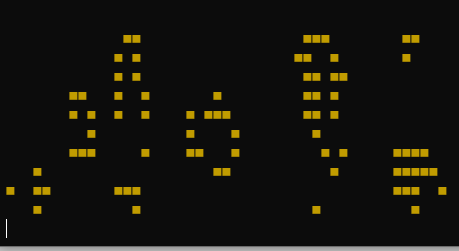

### Öğrenilenler

- Bir metottan birden fazla değişken döndürebiliriz.
- Dictionary koleksiyonu deepCopy ile kopyalayabiliriz.
- Bir Dictionary koleksiyonunun elemanlarını (x,y) gibi tuple türü şeklinde oluşturabiliriz.
- Bir try bloğunda kullanıcının klavyeden verdiği tepkiyi bekleyip akışı değiştirebiliriz.
- Koşullu ifadelerde ve/veya için and/or anahtar kelimelerini kullanırız.
- Sabitleri büyük harf ve snake case tanımlarız.
- O anki thread'i sleep fonksiyonu ile belli bir süre bekletmeye alabiliriz.

## 1337 veya hax0r _(LeetSpeak)_

__Game06_LeetSpeak/sifreliyazi.py__

Kitaptan seçtiğim sıradaki terminal oyunu internetin BBS'ler aracılığıyla popülerleşmeye başladığı yıllarda kullanılan harf değiştirme tekniğine ait. O vakitler buna Leet _(eleet, LeetSpeak olarak da bilinir)_ adını vermişler. Ya da bilinen karşılığı ile 1337 ve hatta hax0r. Metinsel ifadedeki alfabetik karakterlerin yansımalarına bakılarak sayı veya başka sembollere çevrilmesine dayalı eğlenceli bir sistemden bahsediyoruz. Örneğin _leetspeak_ ifadesi _L3375P34_ şeklinde yazılıyor.

Oyundan bir görüntü.

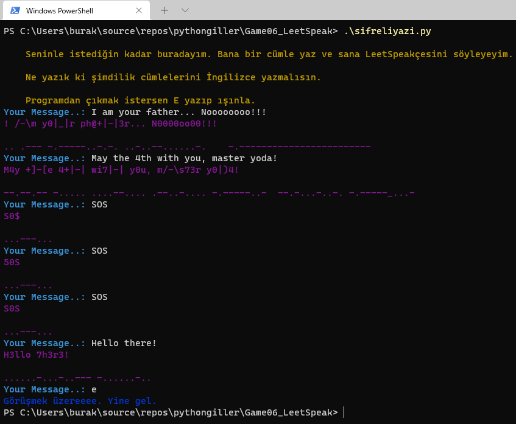

### Öğrenilenler

- Sistemde yüklü olup olmadığını bilmediğimiz bir import işleminde try bloğu kullanabiliriz.
- try bloğunda oluşacak bir istisna durumunu pass ile görmezden gelip kod akışının devam etmesini sağlayabiliriz.
- pyperclip.copy metodu ile bir içeriği sistem panosuna kopyalayabiliriz.
- Bir metin katarındaki karakterleri for döngüsü ile dolaşmamız mümkündür.
- random.choise fonksiyon ile parametre olarak gelen dilimden herhangi birisinin alınmasını sağlayabiliriz.
- 0 ve 1 arasında üretilen rastgele bir sayıyı yüzdesel olarak olasılık hesabına katabiliriz.

## Hayaletler Peşimde _(Hungry Robots)_

__Game07_HungryRobots/ruhakip.py__

Bu sefer seçtiğim oyun oldukça eğlenceliye benziyor. Oyun sahasında yer alan belli sayıda robot oyuncuyu kovalıyor. Amaç onlara yakalanmadan hayatta kalmak. Robotlar birbirlerine çarptığında veya ölü robotlara çarptığında yok oluyorlar. Oyun sahasında robotlar dışında duvarlar da var. Oyuncunun teleporter'ı da bulunuyor ve isterse sahada rastgele bir konuma ışınlanabiliyor. Ben senaryoda robot yerine hayalet, ölü robot yerine avcı kavramlarını kullanmayı planlıyorum. Oyuncunun hayatta kaldığı durumları da puanlayarak bir skor sistemi eklemek istiyorum. Hayaletler birbirlerine çarptığında veya bir avcı hayaletle karşılaştığında aslında avcı hayalete dönüşüp oldukları yerde kalıyorlar. Oyuncu duvarları kullanıp saklanır ve X'leri birbirlerine çarptırıp sahada hiç canlı hayalet kalmayana kadar devam edebilirse oyunu kazanmış sayılıyor. Oyun ekrana sahayı ve güncel konumlarına göre karakterleri çizip oyuncudan sonraki hamlesini bekliyor. Oynayabileceği hamleleri de A,S,D,W,X kombinasyonlarına göre yerleştirir.

İşte birkaç ekran görüntüsü.

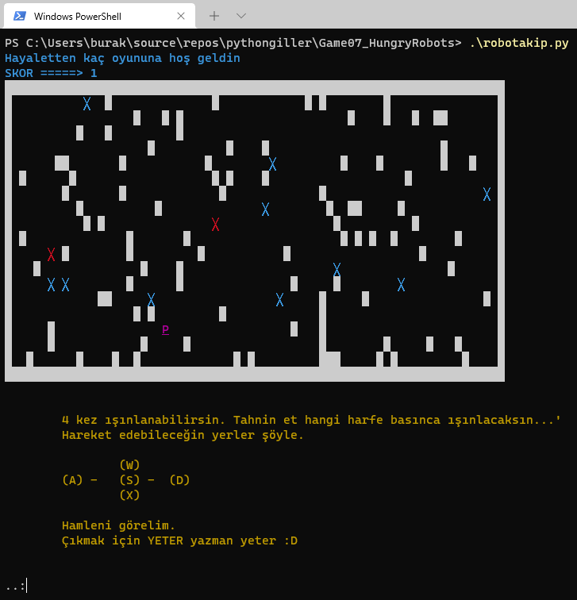

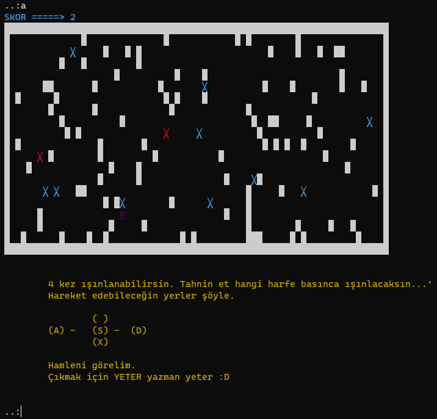

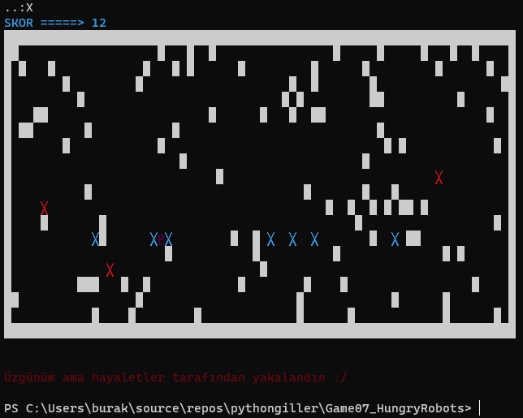

İlk kodlarda oyunu kazanmakta zorlandığım için azcık sabit değerlerle oynadım ve volaaa!!!

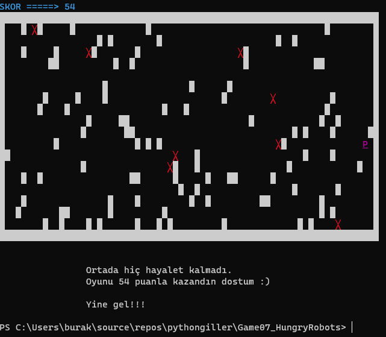

Tüh yahu...

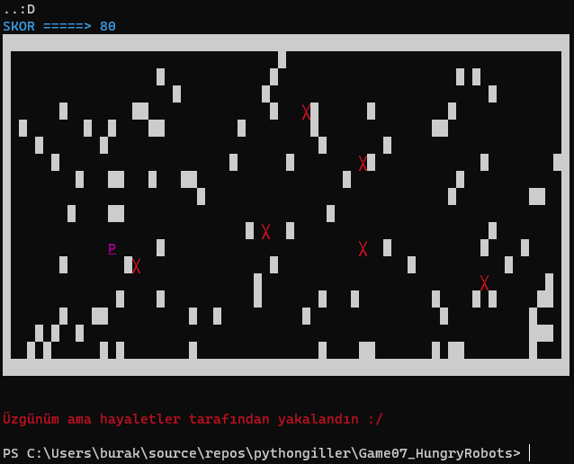

### Öğrenilenler

- _chr_ fonksiyonu ile decimal değerin karşılığı olan bir unicode karakteri elde edebiliriz.
- Bir _for_ döngüsündeki sayaç değerini kullanmıyorsak _ operatörü ile onu kullanmayacağımızı belirtebiliriz.
- Aynı ifadede birden fazla atamayı ardışıl = operatörleri kullanarak sağlayabiliriz. _(x=y=z=3.14 gibi)_
- Bir tuple'ın değerlerini eşitliğin sol tarafındaki ayrı değişkenlere alabiliriz.
- Döngüde herhangi bir koşul sebebiyle sonraki iterasyona devam etmek için _continue_ operatörünü kullanabiliriz.
- Diziden eleman çıkarmak için _del_ fonksiyonundan yararlanabiliriz.
- Bir listeden _remove_ fonksiyonu ile öğe çıkarabilir _append_ ile de ekleyebiliriz.

## Çarpanlarımı Bil _(Factor Finder)_

__Game08_FactorFinder/carpbul.py__

Seçtiğim bir sonraki bölüm bir sayının çarpanlarını bulmak için tasarlanış. İlerleyen kısımlarda asal sayı bulma oyununda kullanılacağı için önce buna bakmak istedim. İşleyiş şöyle; oyuncudan bir sayı girmesi isteniyor ve program bu sayının çarpanlarını söylüyor. Belki bunu biraz daha eğlenceli hale getirebiliriz. Program oyuncuya bir sayı verip çarpanlarını söylemesini isteyebilir. Hatta doğru cevap bulana kadar ki zamanı da ölçüp bir puanlama yapsın ;) Tabii başlamadan önce bir sayının çarpanları nasıl bulunur konusuna bakmakta yarar var. Teorik olarak bir sayının 1 ve kareköküne kadar olan tam bölenlerini çarpanları olarak düşünebiliriz.

İşte oyundan birkaç görüntü.

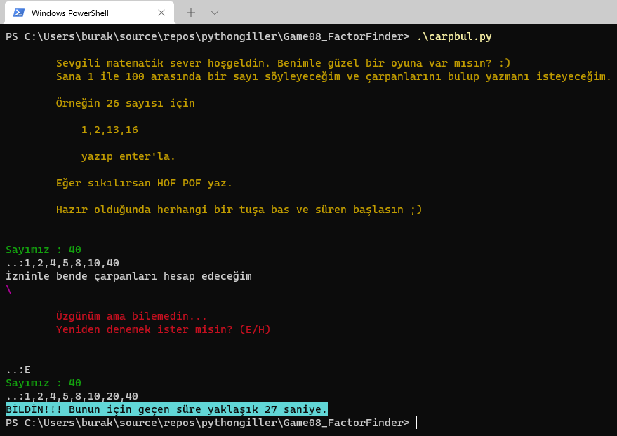

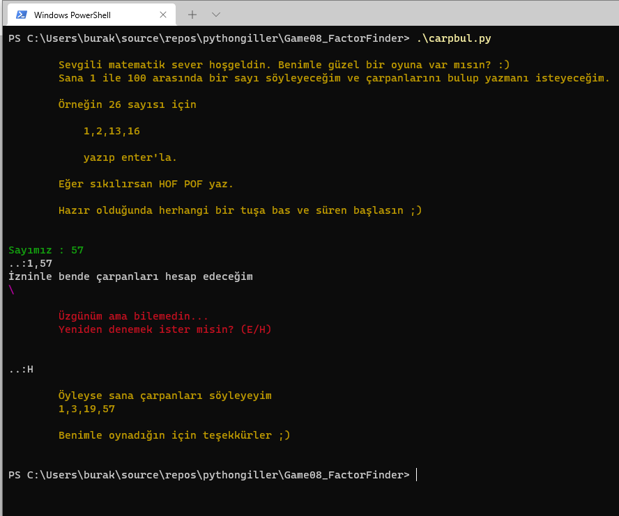

### Öğrenilenler

- Anlık zaman bilgisi için _time_ modülünde _time_ fonksiyonunu kullanabilir, t1 ve t2 arasındaki farkı saniye cinsinden elde edebiliriz.
- _int_ operatörü ile kayan noktalı bir sayının küsürat sonrası sıfıra yuvarlanarak dönüştürülmüş halini elde edebiliriz.
- Bir bölme işleminde küsüratı komple atmak için _//_ operatöründen yararlanabiliriz.
- Bir sayının karekökünü elde etmek için _math_ modülünün _sqrt_ fonksiyonu kullanılabilir.
- _set(iterable özellikte nesne)_ ile iterasyon özelliği sunan bir nesnenin elemanlarının düzensiz sırada ama tekrarsız halini elde edebiliriz. 
- Bir listenin elemanlarını sıralamak için sort metodunu kullanabiliriz.
- _enumerate(iterable özellikte nesne)_ fonksiyonu ile bir nesne dizisi üstünden ileri yönlü hareket etmemizi sağlayacak fonksiyonelliği elde edebiliriz. Enumerate, indis ve elemanın kendisinden oluşan çiftleri kullanmamıza izin verir.
- _str(any)_ ile sayısal bir içeriği string türe dönüştürebiliriz.
- _join_ fonksiyonu ile _iterable_ özellikteki bir _string_ dizisi elemanlarını ilgili karakterle birleştirerek yeni bir metin katarı oluşturabiliriz.
- Belli bir aralıkta yürüyecek _for_ döngüsü oluşturmak için _range_ fonksiyonundan yararlanabiliriz.
- Güncel thread'i belli süre duraksatmak için _time_ modülünün _sleep_ fonksiyonunu kullanabiliriz.

## Collatz Gibi Düşün _(Collatz Sequence)_

Alman matematikçi Lothar Collatz 1932'de henüz 20li yaşların başında iken değişik bir sayı dizisi keşfetmiş. Hatta öyle bir sayı dizisi ki tüm pozitif sayılar için geçerliliği henüz ispatlanamamış. Olay oldukça basit. Sıfırdan büyük bir pozitif sayı alıyoruz. Çift sayı ise ikiye bölüyor, tek sayı ise üçle çarpıp bir ekliyoruz ve bu şekilde sıralamadaki sonraki sayıyı elde ediyoruz. Aynı işlemleri elde edilen yeni sayıya da uyguluyoruz. Collatz'ın keşfi ise şu; sıralama en nihayetinde 1 rakamı ile bir yerde sonlanıyor ve hatta 4,2,1,4 döngüsüyle devam etmeye başlıyor. 

n=7 için bakalım.

- 7 tek sayıdır. Dolayısıyla sonraki sayı (7 * 3) + 1 = 22 olur.
- 22 çift sayıdır ve sonraki sayı 22 / 2 = 11 olur.
- 11 tek sayıdır ve sonraki sayı (11 * 3) + 1 = 34 olur.
- 34 çift sayıdır ve sonraki sayı 17 olur.

Bu şekilde devam edersek aşağıdaki diziyi elde ederiz.

17, 52, 36, 13, 40, 20, 10, 5, 16, 8, 4, 2, 1.

Kitapta bu teoreme göre bir oyun yazdırılmakta. Ben biraz daha değiştirip eğlenceyi artırmaya çalışacağım :) Bilgisayar 1 ile 100 arasında rastgele bir sayı söyleyecek. Oyuncudan Collatz sıralamasına göre kaç adımda 1 sayısına ulaşılacağını tahmin etmesini isteyecek. Bilirse kazanır bilemezse kaybeder ve isterse yeni bir rastgele sayı ile oyuna devam eder. Terminalden oyuncuya Collatz problemini anlatan bir yardım dokümanı hizmeti de sunabilirim.

__Game09_CollatzSequence/collatzgibidusun.py__

Oyundan birkaç görüntü.

### Öğrenilenler

- 